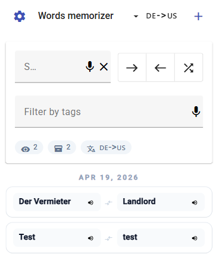
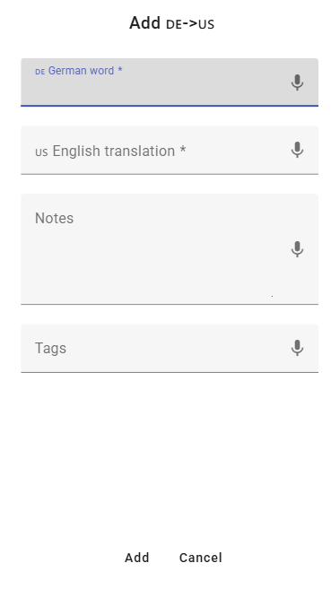
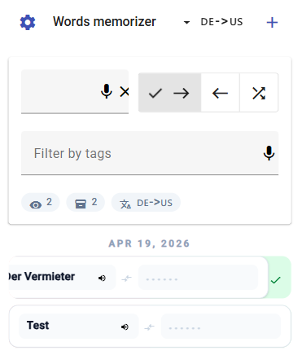
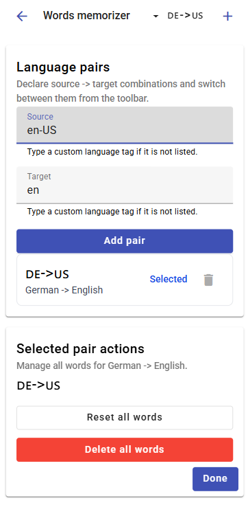

# Words Memorizer

Words Memorizer is a small language-learning web app for building your own vocabulary lists, reviewing them quickly, and installing the app on your phone, tablet, or computer like a native app.

## Open the app

Live app: [https://aurrix.github.io/words-memorizer/](https://aurrix.github.io/words-memorizer/)

Replace the link above with your real GitHub Pages URL if needed.

## What this app does

- Lets you create multiple language pairs such as `English -> German` and `German -> English`
- Stores words locally in your browser, separated by the selected source/target language pair
- Supports notes and tags for each word
- Lets you search by text and tags
- Includes a compact learning mode with swipe grading
- Works as a Progressive Web App (PWA), so you can install it to your Home Screen, desktop, or app launcher

## Getting started

1. Open the live app in your browser.
2. Open **Settings**.
3. Add one or more language pairs.
4. Select the pair you want to study from the top menu.
5. Tap **Add** and create your first words.
6. Return to the main screen and start reviewing.

## Core functionality

### Language pairs

- You can save multiple source -> target language combinations.
- The active pair is selected from the top menu.
- Each pair has its own separate word list and statistics.

### Adding words

- Each word stores:
  - source word
  - target translation
  - notes
  - tags
- Input fields use the selected source/target languages where possible.
- Voice input is available in supported browsers through the microphone icon.
- Reused tags are suggested automatically from tags you already entered before.

### Searching and filtering

- The main screen supports text search.
- Search matches source text, translation, notes, and tags.
- You can also filter the list by one or more tags.

### Learning mode

- Use the mode buttons near the search bar to switch learning direction:
  - source -> target
  - target -> source
  - random
- Tap the active mode again to turn learning mode off.
- In learning mode:
  - swipe right to mark a word correct
  - swipe left to mark a word incorrect
  - double tap a row to reveal the hidden side and notes/statistics
  - long press a row to open actions

### Row actions

- Tap the speaker icon next to a visible word to hear it spoken aloud in supported browsers.
- Long press a row to:
  - reset stats
  - delete the word
- Outside learning mode, notes and statistics stay hidden until you double tap a row.

### Settings

In **Settings** you can:

- add or remove language pairs
- switch the active pair
- reset all words for the selected pair
- delete all words for the selected pair

## Install the app

Words Memorizer works directly in the browser, but installing it makes it feel more like a native app.

### iPhone

Use **Safari**:

1. Open the live app.
2. Tap **Share**.
3. Tap **Add to Home Screen**.
4. Turn on **Open as Web App** if shown.
5. Tap **Add**.

### iPad

Use **Safari**:

1. Open the live app.
2. Tap **Share**.
3. Tap **More** if needed.
4. Tap **Add to Home Screen**.
5. Turn on **Open as Web App** if shown.
6. Tap **Add**.

### Android

Use **Chrome**:

1. Open the live app.
2. Tap the browser menu.
3. Tap **Add to Home screen**.
4. Tap **Install** if Chrome offers the install flow.
5. Follow the prompts.

If the site is offered only as a shortcut, you can still add it and launch it from your Home Screen.

### Windows

Use **Microsoft Edge** or **Chrome**:

- In **Edge**:
  1. Open the live app.
  2. If Edge offers install in the address bar, use it.
  3. Or open `...` -> **More tools** -> **Apps** -> **Install this site as an app**.

- In **Chrome**:
  1. Open the live app.
  2. If Chrome shows the install icon in the address bar, click it.
  3. Or open `...` -> **Cast, save, and share** -> **Install page as app**.

### macOS / Linux

Use **Chrome** or another Chromium-based browser with PWA install support:

1. Open the live app.
2. Use the install icon in the address bar if available.
3. If not, open the browser menu and choose the install option for the page/app.

## Browser support

The app is best used in modern browsers with support for:

- IndexedDB / local browser storage
- installable web apps / PWAs
- Web Speech API for microphone input and text-to-speech

Some features may vary by browser. If speech features are unavailable, the rest of the app still works normally.

## Data and privacy

- Your words are stored locally in your browser on the current device.
- Different browsers keep separate local storage.
- Clearing browser storage may remove your saved words and stats.

If you want to keep long-term study data, avoid clearing site data for the app.

## Troubleshooting

### I do not see the install option

- Refresh the page once after opening it
- Make sure you are using a supported browser
- Try Chrome, Edge, or Safari on the platforms above
- If install still does not appear, use the app in the browser

### I do not see microphone or speaker icons

- Your browser may not support the required speech APIs
- Your device or browser permissions may block microphone access
- Text input and study mode still work without speech features

## Official install help

If browser menus change over time, these official guides are the best fallback:

- Chrome on desktop: [Use web apps](https://support.google.com/chrome/answer/9658361?co=genie.platform%3DDesktop&hl=en)
- Chrome on Android: [Use web apps](https://support.google.com/chrome/answer/9658361?co=GENIE.Platform%3DAndroid&hl=en)
- Chrome shortcuts on Android: [Create shortcuts for websites in Chrome](https://support.google.com/chrome/answer/15085120?co=GENIE.Platform%3DAndroid&hl=en)
- Safari on iPhone: [Turn a website into an app in Safari on iPhone](https://support.apple.com/guide/iphone/open-as-web-app-iphea86e5236/ios)
- Safari on iPad: [Turn a website into an app in Safari on iPad](https://support.apple.com/en-tj/guide/ipad/ipad8f1f7a29/ipados)
- Microsoft Edge: [Install, manage, or uninstall apps in Microsoft Edge](https://support.microsoft.com/en-us/topic/install-manage-or-uninstall-apps-in-microsoft-edge-0c156575-a94a-45e4-a54f-3a84846f6113)
